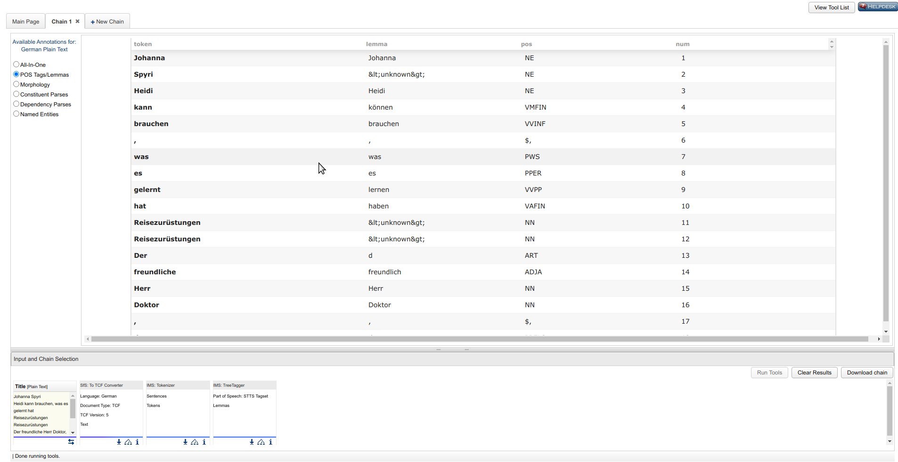

# Language-Resource-Switchboard Schritt für Schritt
## **Kurzbeschreibung**
Das Language Research Switchboard (LRS) ermöglicht die automatische Auswahl von Werkzeugen für die Analyse und Weiterverarbeitung digitaler Ressourcen. Der Schwerpunkt liegt dabei zur Zeit auf dem Bereich des Natural-Language-Processing.

*Bild 1: Startseite des LRS*

## **Datenübergabe an das LRS**
### **Input über den Upload-Bereich**

Es gibt verschiedene Wege, dem LRS Texte zur Weiterverarbeitung zu übergeben:
1. Hochladen einer Datei
2. Angabe einer URL zu einem Text
3. Direkte Texteingabe

*Bild 2: Datenübergabemöglichkeiten*

### **Input über angeschlossene Forschungsumgebungen**
#### **TextGrid-Repository**
Inhalte aus dem TextGrid Repository können direkt dem Language Resource Switchboard zur Weiterverarbeitung übergeben werden. Diese Funktion steht noch nicht für alle Inhalte des TextGrid Repositorys zur Verfügung. Wenn der direkte Upload möglich ist, wird "Switchboard" im Bereich "Werkzeug" des Menüs auf der linken Seite aufgeführt, wie im untenstehenden Screenshot angezeigt.

*Bild 3: Direkter Aufruf des Switchboards aus dem TextGrid-Repository*

Nach der Übergabe zeigt das Switchboard an, welche Werkzeuge für die übergebenen Daten für die Weiterverarbeitung zur Verfügung stehen. Die Auswahl der Werkzeuge hängt vom Dateityp und der Sprache ab. Beides wird automatisch geprüft und in den Feldern "Mediatype" bzw. "Language" angezeigt. Sollte die Automatik zu einem falschen Ergebnis gelangen, können beide Werte von Hand geändert werden.

*Bild 4: Zur Verfügung stehende Tools für die hochgeladene Datei aus dem TextGrid-Repository*

#### **Virtual Language Observatory (VLO)**
Inhalte aus dem VLO können direkt dem Switchboard übergeben werden, was hier am Beispiel von "Paradise Regain'd" gezeigt wird. 

*Bild 5: Upload aus dem VLO*

Nach einem Klick auf den Titel werden die Details zur Ressource angezeigt. Der Link zum VLO wird erst sichtbar, wenn man mit dem Cursor über die drei Punkte nach der Angabe des Dateiformats fährt.

*Bild 6: Übergabe einer Ressource an das Switchboard aus dem VLO*

Für unterschiedliche Dateiformate stehen unterschiedliche Werkzeuge zur Verfügung. Der folgende Screenshot zeigt das Switchboard-Resultat für eine Textdatei.

*Bild 7: Anzeige von Werkzeugen für die Weiterverarbeitung für VLO-Ressource (Textdatei)*

Für eine XML-Datei derselben Quelle stellt das LRS andere Werkzeuge zur Verfügung.

*Bild 8: Anzeige von Werkzeugen für die Weiterverarbeitung für VLO-Ressource (XML-Datei)*

Die Werkzeuge, die für die Weiterverarbeitung einer Ressource zur Verfügung stehen, können nach Aufgaben sortiert (voreingestellter Standard) oder alphabetisch angezeigt werden. Hierfür muss lediglich "Group by task" abgewählt werden:

*Bild 9: Anzeige passender Werkzeuge in alphabetischer Reihenfolge*

Die Ressource kann nun über Anklicken der Schaltfläche "Open" direkt dem ausgewählten Werkzeug übergeben werden. Die über das Switchboard erreichbaren Werkzeuge erfordern ggf. eine Anmeldung über die Institution oder auch eine extra Registrierung. Im folgenden Screenshot ist das Ergebnis der Bearbeitung durch "WebLicht POSTags Lemmas DE" zu sehen:

*Bild 10: Ergebnis der Weiterverarbeitung*

#### **Mögliche Inkompatibilitäten bei der Übergabe**

Die erreichbaren Werkzeuge gehen unterschiedlich mit den weitergegebenen Ressourcen um. Der NLP-Hub (zweites Werkzeug in der Darstellung in Bild 9) kopiert z. B. den Inhalt einer Textdatei in das Eingabefeld für Text, statt sie auf den eigenen Server als Datei hochzuladen. Dies kann dazu führen, dass der zu bearbeitende Text zu lang ist. In diesem Fall muss die entsprechende Ressource zuerst von der Quelle (TextGrid, VLO) herunter- und dann manuell auf den NLP-Hub-Server hochgeladen werden.

*Bild 11: Mögliche Inkompatibilitäten bei der Ressourcen-Übergabe*
